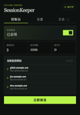
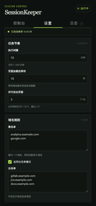
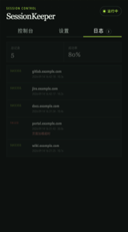

# SessionKeeper

[简体中文](README.md) | **English**

SessionKeeper is a Chrome-only Manifest V3 extension that periodically revisits websites already open in your browser through real background page navigation, helping existing login sessions remain active.

It does not depend on website APIs, inspect business endpoints, inject scripts, or read page content. Settings, runtime state, and logs remain entirely in your local Chrome profile.

## Interface Preview

Click a thumbnail to open the full-size screenshot.

| Dashboard | Settings | Logs |
| :---: | :---: | :---: |
|  |  |  |
| Enable, stop, run now, and status | Frequency, concurrency, and domain rules | Latest 100 execution records |

## Features

- Scans open HTTP and HTTPS tabs automatically
- Extracts each page origin and deduplicates entries by domain
- Visits websites in inactive background tabs without switching the active page
- Waits after page load so website scripts have time to refresh the session
- Supports scheduled runs and immediate manual runs
- Stops all active work immediately and cancels future schedules
- Supports 1–10 parallel background tabs, with a default concurrency of 3
- Supports blacklist and whitelist modes
- Fails a page after a 30-second load timeout without blocking the remaining queue
- Stores the latest 100 execution logs locally
- Recovers persisted work across Manifest V3 Service Worker suspension and restart
- Keeps controls, settings, and logs inside the extension popup
- Saves settings automatically without a save button

## Runtime Behavior

### Scheduled Start

Enabling **Keep Alive** creates a schedule but does not visit any website immediately. The first run begins after one complete configured interval.

For example, with a 10-minute interval, enabling the extension at 12:00 starts the first run at approximately 12:10. Later runs continue at 10-minute intervals.

### Run Now

Clicking **Run Now** starts a run immediately and resets the next scheduled time from that moment.

For example, with a 10-minute interval, clicking **Run Now** at 12:04 starts work immediately and schedules the next run for approximately 12:14.

### Stop All

While work is running, the **Run Now** button changes to **Stop All**. Clicking it immediately:

1. Clears all pending queue entries.
2. Closes every background tab created by the current SessionKeeper run.
3. Cancels future scheduled runs.
4. Disables Keep Alive.

SessionKeeper closes only tabs it created for keep-alive tasks. It never closes the user's original tabs.

## Per-Site Keep-Alive Flow

1. Scan normal tabs currently open in Chrome.
2. Ignore empty URLs, invalid URLs, and non-HTTP/HTTPS pages.
3. Extract the page origin. For example:

       https://gitlab.example.com/project/demo

   becomes:

       https://gitlab.example.com

4. Deduplicate by domain and apply blacklist and whitelist rules.
5. Create inactive background tabs up to the configured concurrency limit.
6. Wait for the page to finish loading.
7. Wait for the configured post-load duration, 10 seconds by default.
8. Close the task tab and record the result.

If a page takes longer than 30 seconds to load, navigation fails, a URL is invalid, or tab creation fails, that task is recorded as failed while the rest of the queue continues.

## Configuration

| Setting | Default | Range or Rule | Description |
| --- | ---: | --- | --- |
| Keep Alive | Enabled | Enabled / Disabled | Waits for one full interval before the first scheduled run |
| Execution interval | 10 minutes | 1–1440 minutes | Frequency of scheduled runs |
| Post-load wait | 10 seconds | 0–300 seconds | Time reserved for website session-refresh scripts |
| Parallel background tabs | 3 | 1–10 | Maximum number of concurrently running task tabs |
| Blacklist | Empty | One domain per line | Matches the domain and all of its subdomains |
| Whitelist mode | Disabled | Enabled / Disabled | When enabled, only whitelisted domains are visited |
| Whitelist | Empty | One domain per line | Used only while whitelist mode is enabled |

The blacklist takes precedence over the whitelist. A rule such as **example.com** matches **example.com**, **www.example.com**, and **jira.example.com**.

### Automatic Saving

- Numeric settings and the whitelist-mode switch are saved immediately after changes.
- Blacklist and whitelist text is saved about 400 milliseconds after typing stops.
- The top of the Settings page reports waiting, saving, saved, or error status.
- Values outside the allowed range do not overwrite the existing configuration.
- Rapid consecutive edits are saved in order so an older request cannot overwrite the latest values.

## Installation and Usage

### 1. Download and Extract

Download the source code and extract it to a permanent directory. Do not move or delete that directory after loading the extension, or Chrome will no longer be able to load it.

The selected directory must directly contain **manifest.json** and should look similar to this:

    SessionKeeper/
    ├── manifest.json
    ├── background/
    ├── popup/
    └── utils/

### 2. Load the Extension in Chrome

1. Enter **chrome://extensions** in the Chrome address bar.
2. Enable **Developer mode** in the upper-right corner.
3. Click **Load unpacked** in the upper-left corner.
4. Select the **SessionKeeper** root directory that contains **manifest.json**.
5. Installation is complete when the SessionKeeper extension card appears.

### 3. Pin the Extension

1. Click the Extensions puzzle icon on the Chrome toolbar.
2. Find SessionKeeper in the list.
3. Click its pin icon so SessionKeeper remains visible on the toolbar.
4. Click the SessionKeeper icon to open the control panel.

### 4. Complete the Initial Setup

1. Open the extension and switch to the **Settings** tab.
2. Configure the execution interval, post-load wait time, and number of parallel background tabs.
3. Add blacklist entries as needed, or enable whitelist mode and enter the domains that may be kept alive.
4. Every change is saved automatically. You may close the popup after it reports that the settings have been saved; there is no Save button.

Enter one domain per line, for example:

    gitlab.example.com
    jira.example.com

### 5. Start Keep Alive

Return to the **Dashboard** and enable **Keep Alive**. SessionKeeper creates the schedule and starts the first run after one complete configured interval.

To execute immediately, click **Run Now**. The current run starts at once, and the next scheduled run is calculated from the time you clicked the button.

You may close the extension popup while a run is active; background work continues normally.

### 6. Stop Keep Alive

While a run is active, the bottom button displays **Stop All**. Clicking it immediately closes SessionKeeper task tabs, clears pending tasks, cancels future schedules, and disables Keep Alive.

If no run is active, disabling the **Keep Alive** switch also cancels future scheduled runs.

### 7. Review Results

Open the extension and switch to the **Logs** tab to view the latest 100 records, including domain, execution time, result, duration, and failure reason.

### Updating a Local Installation

After replacing or modifying project files, open **chrome://extensions** and click **Reload** on the SessionKeeper card. Reloading does not intentionally remove settings or logs already stored in Chrome.

## Permissions

| Permission | Purpose |
| --- | --- |
| **tabs** | Scans current pages and creates or closes SessionKeeper task tabs |
| **alarms** | Schedules runs and resumes timing after Service Worker suspension |
| **storage** | Stores settings, runtime state, and the latest 100 logs locally |
| **webNavigation** | Detects main-frame DNS, connection, certificate, and other navigation failures |
| **http://\*/\*** and **https://\*/\*** | Allows background tabs to visit HTTP/HTTPS websites already opened by the user |

## Privacy and Security

SessionKeeper does not:

- Upload or transmit user data to third parties
- Read page content or modify the page DOM
- Inject content scripts
- Read passwords, cookies, forms, or sensitive page data
- Analyze website APIs, business endpoints, or authentication logic
- Synchronize logs over the network

The extension only creates real Chrome page visits. Configuration and logs are stored in **chrome.storage.local**.

## Logs

The popup's **Logs** page displays the latest 100 entries, including execution time, domain, success or failure result, duration, and failure reason.

When **Stop All** interrupts active tasks, those tasks are recorded as failed with the reason “User stopped the current run,” distinguishing manual interruption from a normal success.

## Project Structure

    SessionKeeper/
    ├── manifest.json
    ├── background/
    │   └── service-worker.js
    ├── popup/
    │   ├── popup.html
    │   ├── popup.js
    │   └── popup.css
    ├── utils/
    │   └── storage.js
    ├── assets/
    │   ├── sessionkeeper-control.png
    │   ├── sessionkeeper-settings.png
    │   ├── sessionkeeper-logs.png
    │   └── thumbnails/
    ├── README.md
    └── README_EN.md

The project uses only JavaScript, HTML, CSS, and official Chrome Extension APIs. It has no third-party runtime dependencies.

## Limitations

- SessionKeeper can only trigger a website's existing session-refresh behavior; it cannot guarantee permanent login on every website.
- Server-side session revocation, password changes, forced reauthentication, and absolute session expiration still require the user to sign in again.
- Websites requiring user gestures, foreground focus, CAPTCHA completion, or special browser policies may not refresh through a background visit.
- Chrome may delay background alarms because of system power-saving policies, so execution times can vary slightly.
- For best control, use whitelist mode for work websites and choose a reasonable execution interval.

## Troubleshooting

### Enabling the extension does not open a background page immediately

This is expected. Enabling Keep Alive only creates the schedule. The first run begins after one full interval. Click **Run Now** if you want to start immediately.

### Will scheduled runs continue after I click Stop All?

No. **Stop All** removes the main alarm and disables Keep Alive. No new run starts until Keep Alive is enabled again.

### A domain does not appear in the monitored list

Check the following:

1. An HTTP/HTTPS page for that website is still open.
2. The domain is not matched by the blacklist.
3. If whitelist mode is enabled, the domain is included in the whitelist.
4. The Settings page reports that the latest changes were saved.

### A log reports a page-load timeout

The main page did not finish loading within 30 seconds. Possible causes include network outages, proxy problems, certificate errors, service failures, or continuous redirects. A failed task does not block other tasks.
